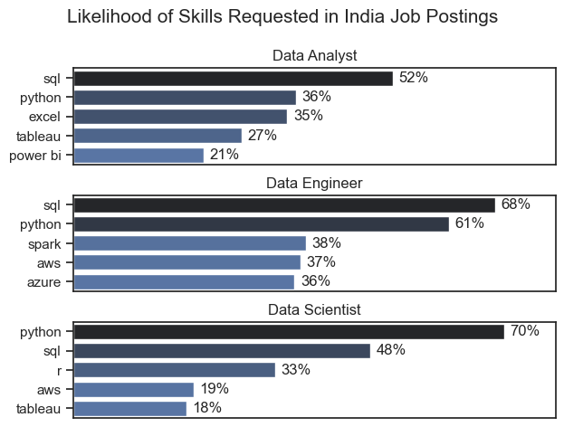
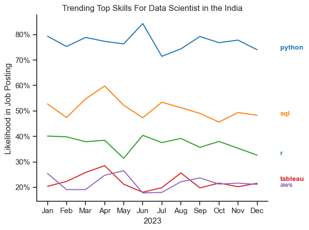
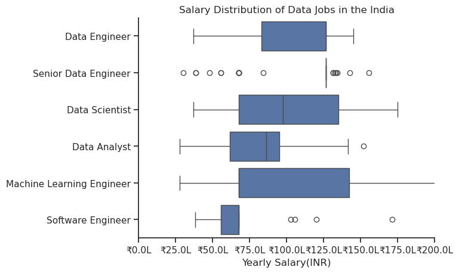
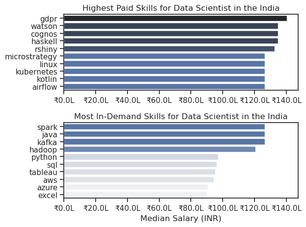
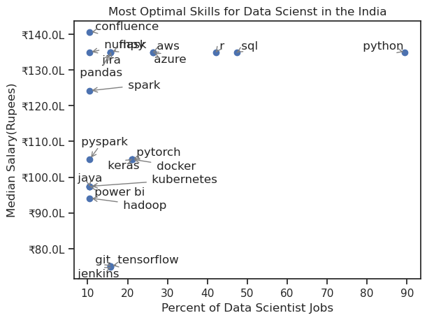
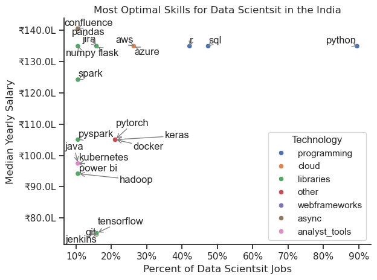

# Overview

Welcome to my analysis of the data job market, focusing on data Scientist roles. This project was created out of a desire to navigate and understand the job market more effectively. It delves into the top-paying and in-demand skills to help find optimal job opportunities for data Scientists.

The data sourced from [Luke Barousse's Python Course](https://lukebarousse.com/python) which provides a foundation for my analysis, containing detailed information on job titles, salaries, locations, and essential skills. Through a series of Python scripts, I explore key questions such as the most demanded skills, salary trends, and the intersection of demand and salary in data analytics.


# The Questions

Below are the questions I want to answer in my project:

1. What are the skills most in demand for the top 3 most popular data roles?
2. How are in-demand skills trending for Data Scientist?
3. How well do jobs and skills pay for Data Scientist?
4. What are the optimal skills for data Scientist to learn? (High Demand AND High Paying) 


# Tools I Used

For my deep dive into the data analyst job market, I harnessed the power of several key tools:

- **Python:** The backbone of my analysis, allowing me to analyze the data and find critical insights.I also used the following Python libraries:
    - **Pandas Library:** This was used to analyze the data. 
    - **Matplotlib Library:** I visualized the data.
    - **Seaborn Library:** Helped me create more advanced visuals. 
- **Jupyter Notebooks:** The tool I used to run my Python scripts which let me easily include my notes and analysis.
- **Visual Studio Code:** My go-to for executing my Python scripts.
- **Git & GitHub:** Essential for version control and sharing my Python code and analysis, ensuring collaboration and project tracking.

# Data Preparation and Cleanup

This section outlines the steps taken to prepare the data for analysis, ensuring accuracy and usability.

## Import & Clean Up Data

I start by importing necessary libraries and loading the dataset, followed by initial data cleaning tasks to ensure data quality.

```python
# Importing Libraries
import ast
import pandas as pd
import seaborn as sns
from datasets import load_dataset
import matplotlib.pyplot as plt  

# Loading Data
dataset = load_dataset('lukebarousse/data_jobs')
df = dataset['train'].to_pandas()

# Data Cleanup
df['job_posted_date'] = pd.to_datetime(df['job_posted_date'])
df['job_skills'] = df['job_skills'].apply(lambda x: ast.literal_eval(x) if pd.notna(x) else x)
```

## Filter India Jobs

To focus my analysis on the Indian job market, I apply filters to the dataset, narrowing down to roles based in the India.

```python
df_in = df[df['job_country'] == 'India']
```

# The Analysis

Each Jupyter notebook for this project aimed at investigating specific aspects of the data job market. Here’s how I approached each question:

## 1. What are the most demanded skills for the top 3 most popular data roles?

To find the most demanded skills for the top 3 most popular data roles. I filtered out those positions by which ones were the most popular, and got the top 5 skills for these top 3 roles. This query highlights the most popular job titles and their top skills, showing which skills I should pay attention to depending on the role I'm targeting. 

View my notebook with detailed steps here: [2_Skill_Demand](2_Skill_Demand.ipynb).

### Visualize Data

```python

fig, ax = plt.subplots(len(job_titles), 1)

for i, job_title in enumerate(job_titles):
    df_plot = df_skills_perc[df_skills_perc['job_title_short'] == job_title].head(5)[::-1]
    sns.barplot(data=df_plot, x='skill_percent', y='job_skills', ax=ax[i], hue='skill_count', palette='dark:b_r')

plt.show()

```
### Results



*Bar graph visualizing the salary for the top 3 data roles and their top 5 skills associated with each.*

### Insights:

- Python is a versatile skill, highly demanded across all three roles, but most prominently for Data Scientists (72%) and Data Engineers (65%).
- SQL is the most requested skill for Data Analysts and Data Scientists, with it in over half the job postings for both roles. For Data Engineers, Python is the most sought-after skill, appearing in 68% of job postings.
- Data Engineers require more specialized technical skills (AWS, Azure, Spark) compared to Data Analysts and Data Scientists who are expected to be proficient in more general data management and analysis tools (Excel, Tableau).

## 2. How are in-demand skills trending for Data Scientist?

To find how skills are trending in 2023 for Data Scientist, I filtered data scientist positions and grouped the skills by the month of the job postings. This got me the top 5 skills of data scientist by month, showing how popular skills were throughout 2023.

View my notebook with detailed steps here: [3_Skill_Trend](3_Skill_trend.ipynb).

### Visualize Data

```python

from matplotlib.ticker import PercentFormatter

df_plot = df_ds_in_percent.iloc[:, :5]
sns.lineplot(data=df_plot, dashes=False, legend='full', palette='tab10')

plt.gca().yaxis.set_major_formatter(PercentFormatter(decimals=0))

plt.show()

```

### Results

  
*Line graph visualizing the trending top skills for data Scientist in the India in 2023.*

### Insights:
- Python remains the most consistently demanded skill throughout the year, although it shows a gradual decrease in demand.
- Both SQL and R show relatively stable demand throughout the year with some fluctuations but remain essential skills for data Scientist.
- Tablue and aws, while less demanded compared to the others, shows a slight upward trend towards the year's end.

## 3. How well do jobs and skills pay for Data Scientist?

To identify the highest-paying roles and skills, I only got jobs in the India and looked at their median salary. But first I looked at the salary distributions of common data jobs like Data Scientist, Data Engineer, and Data Analyst, to get an idea of which jobs are paid the most. 

View my notebook with detailed steps here: [4_Salary_Analysis](4_Salary_Analysis.ipynb).

#### Visualize Data 

```python
sns.boxplot(data=df_in_top6, x= 'salary_ruppe', y= 'job_title_short', order=job_order)

ticks_x = plt.FuncFormatter(lambda y, pos: f'₹{y / 1e5:.1f}L')
plt.gca().xaxis.set_major_formatter(ticks_x)
plt.show()

```
#### Results

  
*Box plot visualizing the salary distributions for the top 6 data job titles.*

- Machine Learning Engineers are the highest-paid with the widest range — indicating a premium for specialization.
- Data Engineers and Data Scientists enjoy solid median salaries with more consistency.
- Data Analysts and Software Engineers trail behind in salary but are more consistent (lower variance).
- The large number of outliers for some roles (esp. Senior Data Engineer) might reflect misclassification, contract roles, or early-career hires within those titles

### Highest Paid & Most Demanded Skills for Data Scientist

Next, I narrowed my analysis and focused only on data scientist roles. I looked at the highest-paid skills and the most in-demand skills. I used two bar charts to showcase these.

#### Visualize Data

```python

fig, ax = plt.subplots(2, 1)  

# Top 10 Highest Paid Skills for Data Scientist
sns.barplot(data=df_ds_top_pay, x='median', y=df_ds_top_pay.index, hue='median', ax=ax[0], palette='dark:b_r')

# Top 10 Most In-Demand Skills for Data Scientist')
sns.barplot(data=df_ds_skills, x='median', y=df_ds_skills.index, hue='median', ax=ax[1], palette='light:b')

plt.show()

```
#### Results
Here's the breakdown of the highest-paid & most in-demand skills for Data Scientist in the India:



*Two separate bar graphs visualizing the highest paid skills and most in-demand skills for data scientist in the India.*

#### Insights:

- The top graph shows specialized technical skills like `gdpr`, `wantson`, and `cognos` are associated with higher salaries, some reaching up to ₹140L, suggesting that advanced technical proficiency can increase earning potential.

- The bottom graph highlights that foundational skills like `Spark`, `Java`, and `Kafka` are the most in-demand, even though they may not offer the highest salaries. This demonstrates the importance of these core skills for employability in data scientist roles.

- There's a clear distinction between the skills that are highest paid and those that are most in-demand. Data scientist aiming to maximize their career potential should consider developing a diverse skill set that includes both high-paying specialized skills and widely demanded foundational skills.

## 4. What are the most optimal skills to learn for Data Scientist?

To identify the most optimal skills to learn (the ones that are the highest paid and highest in demand) I calculated the percent of skill demand and the median salary of these skills. To easily identify which are the most optimal skills to learn. 

View my notebook with detailed steps here: [5_Optimal_Skills](5_Optimal_Skills.ipynb).

#### Visualize Data

```python
from adjustText import adjust_text
import matplotlib.pyplot as plt

plt.scatter(df_ds_skills_high_demand['skill_percent'],df_ds_skills_high_demand['median_salary'])
plt.show()

```

#### Results

    
*A scatter plot visualizing the most optimal skills (high paying & high demand) for data scientist in the India.*

### Visualizing Different Techonologies

Let's visualize the different technologies as well in the graph. We'll add color labels based on the technology (e.g., {Programming: Python})

#### Visualize Data

```python
from matplotlib.ticker import PercentFormatter

# Create a scatter plot
scatter = sns.scatterplot(
    data=df_ds_skills_tech_high_demand,
    x='skill_percent',
    y='median_salary',
    hue='technology',  # Color by technology
    palette='bright',  # Use a bright palette for distinct colors
    legend='full'  # Ensure the legend is shown
)
plt.show()

```

#### Results

  
*A scatter plot visualizing the most optimal skills (high paying & high demand) for data scientist in the India with color labels for technology.*

#### Insights:

- The scatter plot shows that most of the programming skills (colored blue), libraries skills (colored green) and colud(colored orange) tend to cluster at higher salary levels compared to other categories, indicating that programming,libraries and colud expertise might offer greater salary benefits within the data scientist field.

- The libraries skills (colored orange), such as flask, panda and numpy, are associated with some of the highest salaries among data scientis tools. This indicates a significant demand and valuation for data management and manipulation expertise in the industry.

# What I Learned

Throughout this project, I deepened my understanding of the data scientist job market and enhanced my technical skills in Python, especially in data manipulation and visualization. Here are a few specific things I learned:

- **Advanced Python Usage**: Utilizing libraries such as Pandas for data manipulation, Seaborn and Matplotlib for data visualization, and other libraries helped me perform complex data analysis tasks more efficiently.
- **Data Cleaning Importance**: I learned that thorough data cleaning and preparation are crucial before any analysis can be conducted, ensuring the accuracy of insights derived from the data.
- **Strategic Skill Analysis**: The project emphasized the importance of aligning one's skills with market demand. Understanding the relationship between skill demand, salary, and job availability allows for more strategic career planning in the tech industry.


# Insights

This project provided several general insights into the data job market for scientist:

- **Skill Demand and Salary Correlation**: There is a clear correlation between the demand for specific skills and the salaries these skills command. Advanced and specialized skills like Python and SQL often lead to higher salaries.
- **Market Trends**: There are changing trends in skill demand, highlighting the dynamic nature of the data job market. Keeping up with these trends is essential for career growth in data scientist.
- **Economic Value of Skills**: Understanding which skills are both in-demand and well-compensated can guide data scientist in prioritizing learning to maximize their economic returns.
